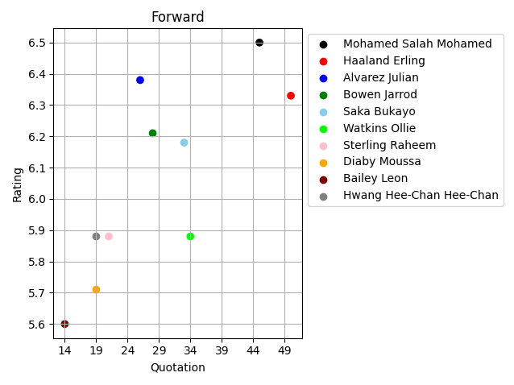
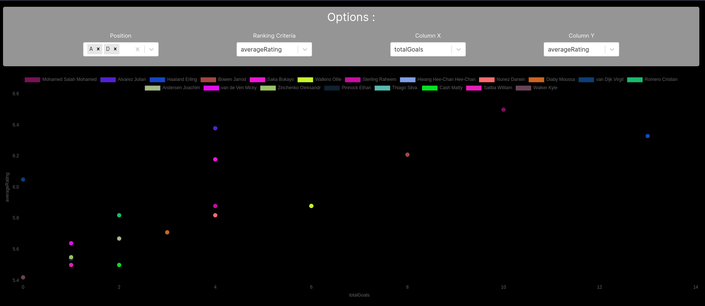

# MPG DATA ANALYSIS PROJECT

## Introduction

This is a tool to better visualize the data from the MPG dataset. Also, some data are not available in the MPG UI, so this tool will help to get them.

MPG is a fantasy football game where 2-10 players compete in a private championship, using a budget of €500M to buy real-life
football players for their team.
Matches are won by scoring goals, which are based on the players’ real-life performance.

Therefore, it is crucial to draft correctly at the beginning of the season. And what better way than using data analysis ?

#### Note :

*This project is a part of my data engineering learning path.*
*The goal is to create a data pipeline that will extract data from a source, transform it and load it into a destination.*

*This ETL process is done with no tools except Python and Pandas.*

## Project description

The goal of this project is to help you make better decision before the draft, by analyzing the data from the MPG dataset.

It first requests the data from the MPG API, then it cleans it and finally displays it.

The dataset used is available here : https://api.mpg.football/api/data/championship-players-pool/2?season=2023

### Cleaning 

The data is cleaned from unnecessary columns and rows, and the data types are converted to the right ones.

If you want to see the cleaning process, you can check the `cleaning` function in [general_functions.py](utils/general_functions.py).

### Displaying

At first, I just wanted to have a simple script to plot the data using pyplot, but I thought it would be more interesting to create a web app.
With a very minimalist front-end effort.

You have two options to visualize the result :
- The first is via a python script that will plot the data using pyplot



- The second is via a Flask web app that will display the data in a more user-friendly way



### Python script

The script is available in [mpg_main.py](mpg_main.py). Most of the functions used are in [general_functions.py](utils/general_functions.py).

To avoid duplicating code, I created a `plot_players` function that will plot the data using pyplot.

If you want to customize the plots you will have to dive in the code.

### Flask web app

The Flask web app back-end part is available in [flask_api](flask_api). And the front end part is in [front directory](front).

The back-end part is composed of two files :
- [app.py](flask_api/app.py) : the main file that will run the Flask app, initialize the celery and stuff
- [routes.py](flask_api/routes.py) : This file contains all the routes of the app and the functions that will be called when a route is requested (when they are not in [general_functions.py](utils/general_functions.py))

### Celery

Celery is used to run periodically some of the data extraction and transformation in the background.

One of the important data to have is the players' draft pick rate (called mercatoPR most of the time). This information 
is not available in the MPG base player dataset, so I had to extract it from the player extra stats api (an example is 
available [here]("https://api.mpg.football/api/data/championship-player-stats/mpg_championship_player_118748/2023")).

The problem is that we plot several players at the same time and each player means one request to his specific endpoint.
Which would make the Flask website very slow (1,5s for 10 players for example).

Therefore, I decided to use Celery to run the requests in the background and store the results in a sqlite database.
The tasks will request for the top 25 players by position and then do one request to each endpoint to get the extra data.
Once done, data is cleaned, and we store the key value id:mercatoPR in the database.

This mercatoPR is added to the player dataframe returned/plotted.

The Celery task is defined directly in [app.py](flask_api/app.py) and is called every day at midnight to keep data up-to-date.

### How to use

For the basic script, you just need to install the requirements and run the script.

**Important : You need to have a redis server running on your machine.**

For the Flask app, you need to install the requirements for both front and backend
```shell
pip install -r requirements.txt
```
```shell
cd front
npm install
```

For the front end to run correctly, you need to create a .env.local file (in the front dir) containing the key "NEXT_PUBLIC_API_URL"


Then initialize the database :
```shell
make create_database
```
Then you need to run the celery worker, the celery beat and the Flask app.
You can use this [makefile](makefile) to do so :

Celery worker :
```shell 
make celery_worker
```
Celery beat :
```shell
make celery_beat
```
Flask app :
```shell
make flask_app
```
